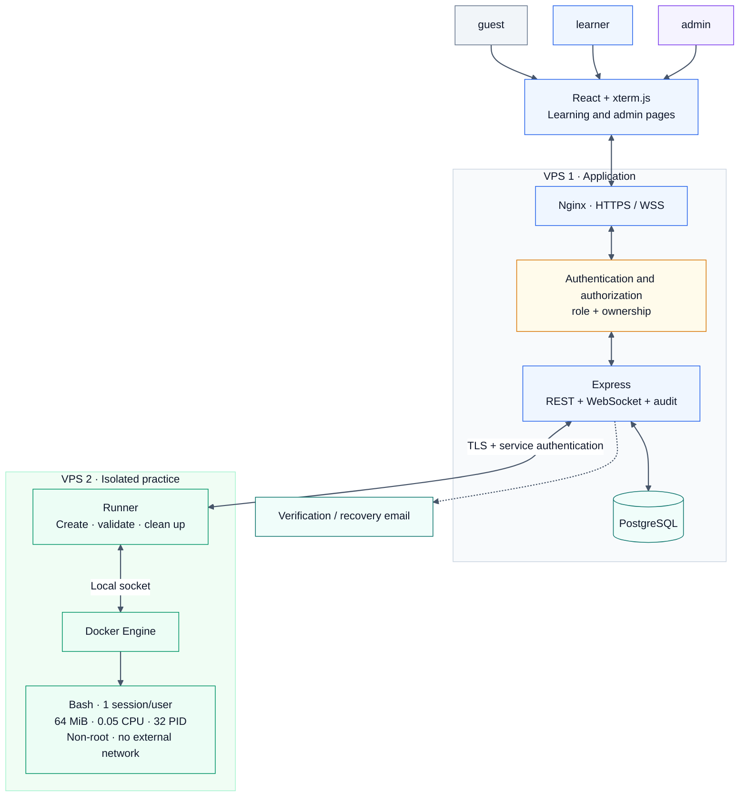
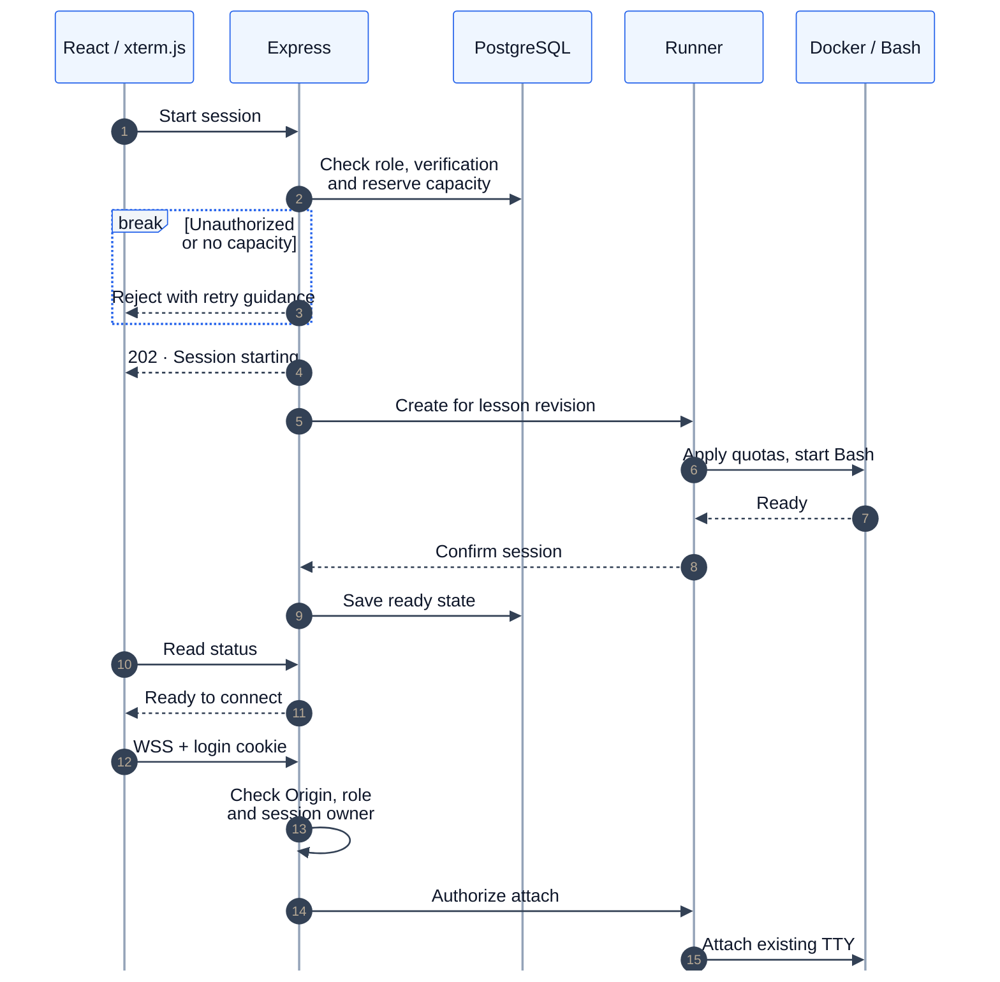
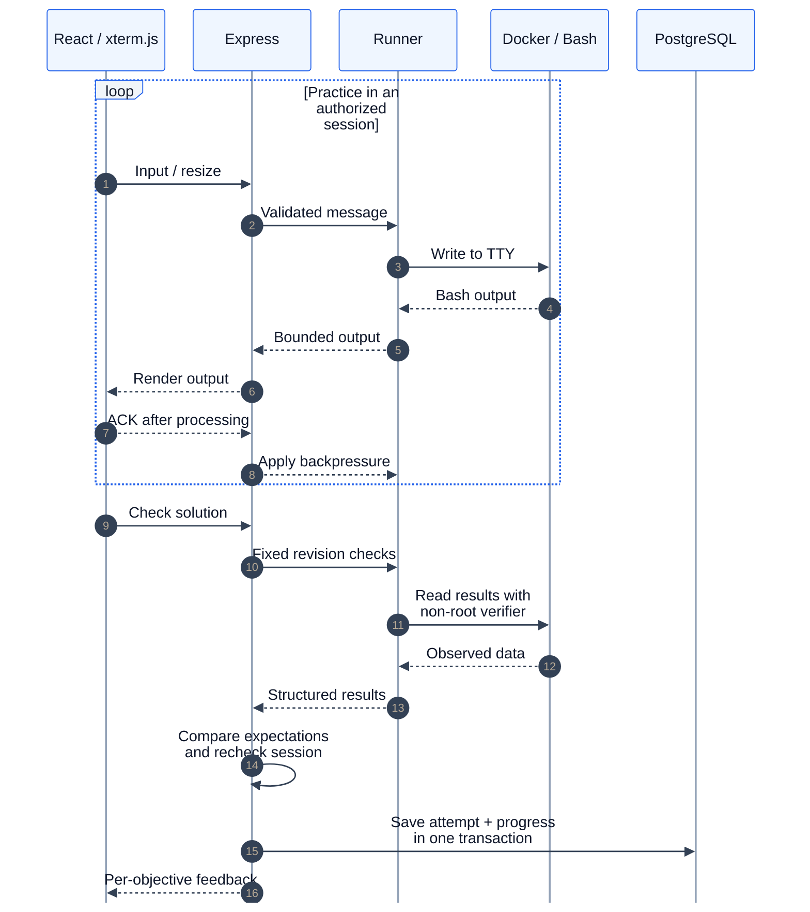
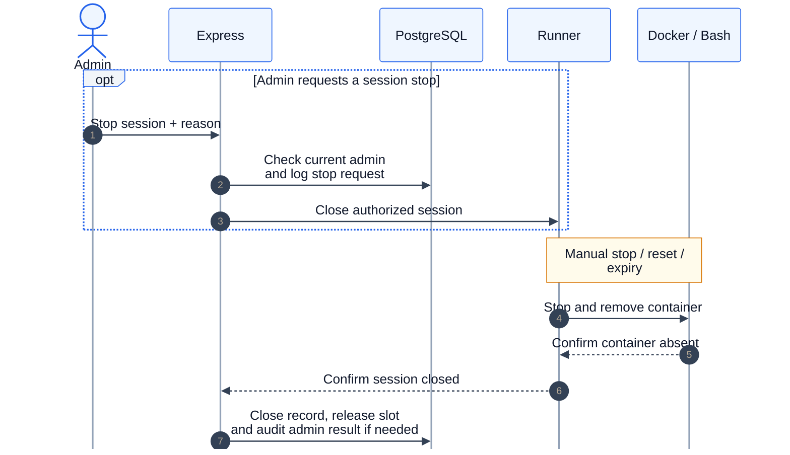
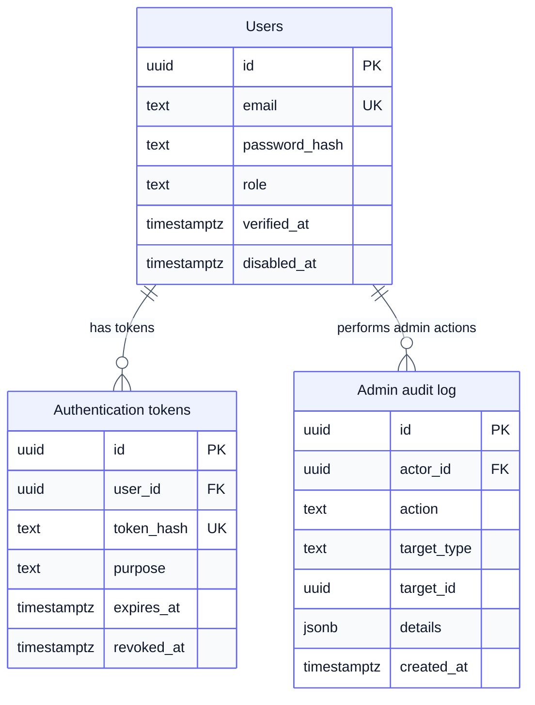
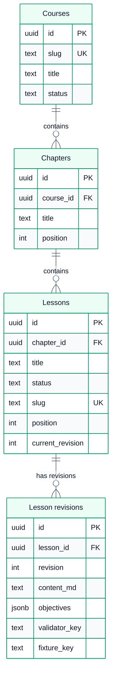
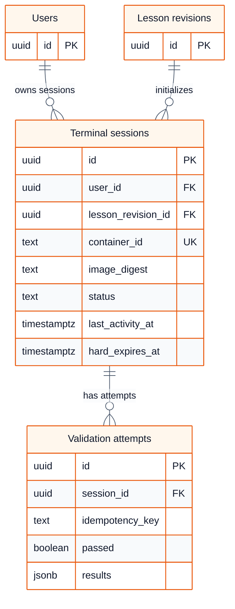
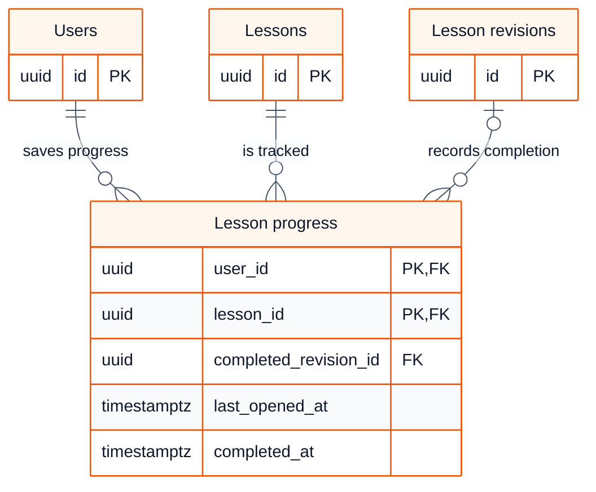

# BashLab — MVP implementation plan

Status: awaiting approval; no application code has been written.
Updated: 2026-09-11. Interface reference: [image.png](image.png).
English edition; matching [Vietnamese translation](plan.vi.md).

## 1. Goal and scope

BashLab helps beginners learn Linux commands by reading a short explanation, practicing in real Bash, and checking the result on the website.
The MVP focuses on one complete learning loop: choose a lesson → practice → check → save progress → continue.
All lessons are free. VIP, account top-ups, payments, and transaction history are entirely removed.

| Feature | Implementation scope |
|---|---|
| Landing page | Explain the learning method, preview courses, provide a start action |
| Accounts | Registration, login/logout, verification/recovery, guest/learner/admin access |
| Content | Ordered courses → chapters → lessons |
| Lesson page | Instructions, examples, objectives, hints, and terminal |
| Practice | Real Bash in Docker, one active session per user |
| Validation | Server checks results when the learner selects Check solution |
| Progress | Completed lessons, course percentage, resume the last lesson |
| Operations | Session cleanup, resource monitoring, database backups |
| Administration | Users/roles, content publishing, session monitoring, action history |

Initial content: 12–16 lessons across two small courses.

- Linux fundamentals: directories, files, reading content, and permissions on learner-owned files.
- Bash text processing: redirection, pipes, `grep`, `sort`, `uniq`, `cut`, and introductory `awk`.

Each lesson has 1–3 objectives, uses small fixtures, and must work within the container limits.
Defer the course editor, leaderboards, certificates, AI, multiple terminals, and persistent home directories.
Exclude package installation, root administration, networking, and large datasets from the initial curriculum.
Author lesson bodies/checkers in Git and import revisions; admin manages metadata, order, and publication in the website.

### Roles and permissions

| Action | guest | learner | admin |
|---|---|---|---|
| Read published catalog/lessons | Yes | Yes | Yes |
| Use a terminal and save own progress | No | Verified account | Same learner limits |
| Access another user's shell or change their results | No | No | No |
| Manage accounts/roles and view progress summaries | No | No | Yes, audited |
| Manage content metadata/publication | No | No | Yes, imported revisions only |
| View session metadata, stop problematic sessions, read audit logs | No | No | Yes, with a reason for stopping |

`guest` means an unauthenticated visitor, not a database account. Store only `learner` or `admin` in `users.role`; new registrations always become learners.
The API enforces role, account status, and resource ownership on every request; hiding admin buttons is only a UI convenience. [Authorization guidance](https://cheatsheetseries.owasp.org/cheatsheets/Authorization_Cheat_Sheet.html)

## 2. Fixed technology stack

| Component | Choice |
|---|---|
| Frontend | HTML5, React 19, JavaScript/JSX |
| Styling | Vanilla CSS, CSS custom properties, Flexbox, and Grid |
| Build tooling | Vite, npm, and a lockfile |
| Routing | React Router |
| Backend | Node.js 24 LTS, Express.js 5 |
| Communication | REST API and WebSocket using `ws` |
| Terminal | `@xterm/xterm` and the fit addon |
| Database | PostgreSQL 18, `pg`, SQL migrations |
| Sandbox | Docker Engine on Linux, GNU Bash and required GNU utilities |
| Reverse proxy | Nginx, HTTPS/WSS |
| Testing | Node test runner and Playwright, both using JavaScript |

No TypeScript or Tailwind CSS in source, configuration, or tests.
Choose PostgreSQL; there is no current technical reason to switch to MySQL or support both.
Pin library versions and images when implementation begins; use supported patch releases.
Do not introduce an ORM, Redis, a separate queue service, or Kubernetes at this scale.

## 3. Interface and sitemap

Follow `image.png`: dark surfaces, green accents, instructions on the left, terminal on the right.
Keep one objectives list; prioritize clear state and feedback over decorative controls.
Desktop uses a resizable split; smaller screens switch between Lesson and Terminal tabs.
Main actions: Start terminal, Check solution, Reset, Stop, Next lesson.

```text
/
├── /courses
│   └── /courses/:courseSlug
├── /register
├── /login
├── /verify-email
├── /forgot-password
├── /reset-password
├── /dashboard
├── /learn/:courseSlug/:lessonSlug
├── /account
├── /admin
│   ├── /admin/users
│   ├── /admin/content
│   ├── /admin/sessions
│   └── /admin/audit-logs
└── /help
```

Course pages show chapters, lessons, estimated duration, and progress.
Guests can read published lessons; only active verified learners/admins can open their own sandbox.
Create a container only when the learner selects Start, not when the page opens.
Show starting, ready, checking, disconnected, expired, and capacity-full states.
Resetting or switching lessons must explain that temporary files will be lost; completed progress remains.
Support keyboard navigation, visible focus, readable text, and a way to move focus out of the terminal.
Admin uses simple tables/forms: filter users, enable/disable accounts, change roles, and inspect learning summaries.
Content controls create/edit course/chapter metadata, reorder lessons, select imported revisions, and publish/unpublish; no rich editor or checker uploads.
Imports add revisions without overwriting admin metadata/publication; switching a published revision validates dependencies and updates the active pointer atomically.
Publishing verifies fixtures/checkers exist; unpublishing blocks new access/sessions while already-running pinned sessions may finish until expiry.
The session screen shows owner/lesson/age/status and Stop with a reason; audit history is read-only. No shell takeover, progress editing, bulk deletion, or resource-limit controls.

## 4. Proposed architecture

Serve React and the API through Nginx on the same domain; run Docker on a separate VPS.
Diagrams use a separate light theme: blue for web, amber for authorization, green for sandboxes, and purple for admin.
This keeps login/WebSocket configuration simple and separates learner command execution from account data.



Only two application processes are needed: the API and runner; no separate worker is required in the MVP.
The API manages accounts, lessons, progress, and session authorization.
The runner creates/removes containers, streams terminal data, runs checks, and cleans up sessions.
Only the runner can access the Docker socket; the API and learner containers cannot.
The runner holds no database password or learner account details.

Vercel remains an option for React, but the long-running backend and Docker stay on Linux servers.
With Vercel, use `app.example.com` for the frontend and `api.example.com` for API/WSS; configure origins and cookies explicitly.
One VPS hosting everything is suitable for an internal trial, but exposes a larger shared risk when strangers can run shells.
The public deployment default remains two VPSs; a managed database is not required initially.

## 5. Terminal lifecycle

Each user has at most one live session and one connection authorized to send input.
A second tab reuses the existing session; taking control requires an explicit takeover from the previous tab.
Refreshing the page reconnects to the running Bash process instead of creating another container.

| Event | Behavior |
|---|---|
| Start lesson | Check authorization, reserve capacity, create from the approved image |
| Connection lost | Retain the session until inactivity expiry |
| Idle for 10 minutes | Display a warning |
| Idle for 12 minutes | Stop/remove the container; cleanup runs every 30 seconds |
| Session reaches 60 minutes | Warn five minutes beforehand, then require a fresh session |
| Reset/switch lesson | Remove the old session before creating a new one |
| Command exceeds resources | Explain the failure and allow restart without losing progress |
| Lesson completed | Keep the terminal available until stopped or expired |

Only accepted input and accepted validation requests count as activity.
Heartbeats, resize events, continuous output, and an open tab do not extend session lifetime.
The API rechecks login/account role each minute and renews runner control authorization for at most two minutes.
Logout, disablement, or a role change revokes existing login sessions and sockets; runner leases bound cleanup if a direct stop fails.
Sandbox files are temporary; recovery is not guaranteed after container removal or VPS failure.

## 6. Docker and WebSocket flow

Read these as three stages; solid arrows are requests, dashed arrows are responses or ACKs.

**6.1 · Start and connect**



**6.2 · Practice and validate**



**6.3 · Stop and release resources**



Docker provides the TTY; the runner uses attach/resize APIs through a JavaScript library such as `dockerode`.
Individual containers need no SSH, `node-pty`, WebSocket server, or network port.
Never assemble Docker commands from user-supplied strings; the server controls every container setting.

## 7. Sandbox limits and protection

| Resource or permission | Setting |
|---|---|
| RAM | 64 MiB in Docker units, implementing the requested 64 MB target |
| Additional swap | Disabled |
| CPU | 0.05 CPU hard quota; CPU shares are not a substitute |
| Processes | At most 32, including init, Bash, and validation processes |
| Execution identity | Non-root UID/GID |
| Network | `none`, no published ports; loopback only |
| Root filesystem | Read-only |
| Working directory | 16 MiB tmpfs; allow scripts taught by the lessons |
| `/tmp` and shared memory | At most 8 MiB and 1 MiB respectively |
| Linux privileges | Drop all capabilities; enable `no-new-privileges` |
| System policy | Retain default seccomp and Linux host confinement |
| Open files | Initial limit of 256 descriptors per process |

Tmpfs usage is part of the 64 MiB memory budget, not additional RAM.
Use a Debian slim image containing Bash and required GNU utilities; install tools during image build.
Keep the image read-only, use a small init to reap children, and do not automatically restart learner sessions.
Never mount host directories, the Docker socket, devices, or secrets into a sandbox.
Prefer rootless Docker on Linux with correctly configured cgroup v2 and systemd.
Verify actual enforcement; Docker configuration alone does not prove that limits are working.
If the host cannot enforce the limits, do not open public terminals or silently weaken the profile.
Containers share a kernel: a separate VPS reduces the blast radius but does not fully replace VM isolation.

## 8. Validation and progress

Validate observable results only: files/directories, content, and permissions.
For example, a learner filters logs into an answer file, which the server compares with the required result.
Accept different correct solutions instead of requiring an exact command string.

- The server selects checks for the lesson revision; the browser cannot submit a checker command.
- Use fixed tooling, a clean environment, and a separate non-root verifier identity.
- Do not execute learner-written scripts to decide pass/fail or treat terminal output as proof.
- Read only valid files within allowed paths; reject symlinks, FIFOs, oversized files, and unexpected paths.
- Allow one check at a time per session and at most four concurrent checks across the runner.
- Initial limits: five seconds per check and 32 KiB of results; verify against real lessons.
- If a timed-out checker cannot be confirmed stopped, remove its sandbox.
- Recheck session ownership/state before saving progress to reject stale results after reset.

A single check must satisfy every required objective; do not combine obsolete partial passes.
Store per-objective feedback, timestamp, and lesson revision, not full terminal history.
Completed progress survives resets and content corrections; course percentage is derived from completed lessons.
A separate Docker exec does not know the interactive shell's current directory or variables; do not infer command history from it.
This is educational validation, not an anti-cheating system for examinations.

## 9. PostgreSQL design

Version lesson content so requirements do not change during an active session.
Individual objectives do not need their own table: store them as JSONB in the lesson revision.
The ERD shows principal fields; timestamps and additional constraints will be completed during implementation.
Diagram labels are localized; column names, data types, API routes, and configuration keys remain identical across both editions.
The ERD has three views; tables shown with only `id` in later views reference the full definitions in earlier views.

**9.1 · Accounts and administration**



**9.2 · Curriculum and lesson revisions**



**9.3 · Practice sessions and progress**



**9.4 · Lesson progress**



Enforce case-insensitive email uniqueness; hash passwords with a suitable function such as `scrypt` and a unique salt.
Store only hashes of login/reset/verification tokens; mark single-use tokens as consumed.
Use foreign keys, parameterized queries, and UTC timestamps; constrain `users.role` to `learner/admin` with default `learner`.
Bootstrap the first admin by an explicit server-side CLI promotion of a verified account; record it and never ship a default admin password.
Role/status changes require recent password confirmation (five minutes), a transaction protecting the last active verified admin, and an audit entry; reject self-lock/demotion.
Audit records contain actor, action, target, sanitized changes/reason, and time; append stop-request and stop-result entries, with no passwords or terminal content. Application access is insert/read only, with no edit/delete route.
Enforce unique lesson positions within each chapter and unique revision numbers within each lesson.
Use a partial unique index for one `starting/ready/detached/closing` session per user.
Reserve total capacity under a transaction lock; release it only after container removal is confirmed.
Save validation and completion in one transaction; scope idempotency keys to the session.
Never edit published revisions; retain matching checkers/images while sessions still use them.

## 10. API and web security

REST uses the `/api/v1` prefix; always authorize resources against the current user.

| Method | Path | Purpose |
|---|---|---|
| POST | `/auth/register`, `/auth/login`, `/auth/logout`, `/auth/reauth` | Accounts, login sessions, recent password confirmation |
| POST | `/auth/verify-email`, `/auth/resend-verification` | Email verification |
| POST | `/auth/forgot-password`, `/auth/reset-password` | Account recovery |
| GET | `/auth/csrf`, `/me` | CSRF token and current user |
| GET | `/courses`, `/courses/:slug` | Catalog and course outline |
| GET | `/lessons/:id` | Authorized lesson content without private checkers |
| POST | `/lessons/:id/open` | Record the last-opened lesson |
| GET | `/me/progress` | Progress and resume target |
| POST | `/terminal-sessions` | Reserve/create or return a compatible session |
| GET | `/terminal-sessions/current` | Current session state |
| DELETE | `/terminal-sessions/:id` | Idempotent stop/removal |
| POST | `/terminal-sessions/:id/reset` | Replace with a clean sandbox |
| POST | `/lessons/:id/check` | Validate a session and return feedback |
| GET | `/health/live`, `/health/ready` | Application health; report runner availability separately |
| GET | `/admin/overview`, `/admin/users`, `/admin/sessions`, `/admin/audit-logs` | Admin-only, filtered/paginated operational data |
| PATCH | `/admin/users/:id/role`, `/admin/users/:id/status` | Role/account changes; recent password confirmation and audit |
| GET, POST, PATCH | `/admin/courses`, `/admin/courses/:id`, `/admin/chapters`, `/admin/chapters/:id` | List/create collections; patch a specific item's metadata/order |
| GET, PATCH | `/admin/lessons`, `/admin/lessons/:id` | List imported lessons; edit metadata/order/selected revision |
| POST | `/admin/lessons/:id/publish`, `/admin/lessons/:id/unpublish` | Explicit publication transition; validate revision dependencies |
| POST | `/admin/terminal-sessions/:id/stop` | Reason and idempotency key; audited stop request, pending until confirmed |

Terminal creation may return `202` while the UI polls status; incorrect solutions return a normal result with `passed=false`.
Distinguish unauthenticated `401`, unauthorized/hidden resources `403/404`, conflict `409`, invalid input `422`, rate limits `429`, and unavailable capacity `503`.
WebSocket uses `/ws/terminal-sessions/:id`, a login cookie, and an exact `Origin` check before attachment.
Production cookies are Secure, HttpOnly, and host-only; state-changing REST requests require CSRF protection.
Never put login tokens or Docker IDs in URLs; UUIDs do not constitute authorization.
Limit registration, login, session creation/reset, validation, and message sizes.
Sanitize Markdown; render terminal data through xterm rather than injecting HTML.
All `/admin/*` requests require a currently active, verified admin read from the database; reject guest/learner calls even with forged role fields.
Registration/profile updates allowlist fields and never accept `role`; `/me` returns the effective role for navigation, not for client-side authorization.

## 11. Capacity control and recovery

| Load | Maximum container memory | Aggregate CPU quota | Maximum processes |
|---|---:|---:|---:|
| 20 sessions | 1.25 GiB | 1 CPU | 640 |
| 50 sessions | 3.125 GiB | 2.5 CPUs | 1,600 |

These are limit calculations, excluding Linux, Docker, and Node overhead; they are not benchmark results.
Suggested starting hosts: application VPS with 2 vCPU/4 GiB; runner VPS with 4 vCPU/8 GiB.
Start with 20 sessions and raise to 50 only after testing; also limit admission based on host health.

- Reserve slots for sessions being created or deleted; the runner independently enforces its own cap.
- Limit simultaneous container starts to four; cache the image instead of building/pulling on demand.
- Load xterm on the lesson route; retain approximately 2,000 scrollback lines.
- Initial limits: 16 KiB per input message and roughly 256 KiB of output buffering per session.
- Acknowledge data after xterm processes it and propagate backpressure across every hop; stop sessions that still overwhelm buffers.
- Do not write every keystroke to the database; batch activity updates approximately every 30 seconds.
- Label containers with application ownership, session ID, lesson revision, and expiry.
- On API/runner restart, reconcile database records with labeled containers and handle orphans before admitting more sessions.
- A create/delete timeout does not prove failure; inspect by session ID to prevent duplicates or premature slot release.
- Remove only BashLab containers; keep lessons and progress readable when the runner is unavailable.

## 12. Proposed folder structure

```text
bashlab/
├── plan.md                  # English edition
├── plan.vi.md               # Vietnamese edition
├── image.png
├── frontend/
│   ├── index.html
│   ├── vite.config.js
│   └── src/
│       ├── app/              # App.jsx, router.jsx
│       ├── pages/            # Landing, accounts, courses, lessons, admin
│       ├── components/       # Layout, objectives, terminal
│       ├── hooks/
│       ├── lib/              # REST client, terminal connection
│       └── styles/           # Vanilla CSS
├── backend/
│   ├── src/
│   │   ├── server.js
│   │   ├── modules/          # auth, courses, progress, terminals, admin, audit
│   │   └── middleware/
│   ├── migrations/           # Versioned SQL
│   └── tests/                # JavaScript
├── runner/
│   ├── src/                  # Docker, sessions, validation, cleanup
│   └── tests/
├── content/                  # Markdown, JSON, fixtures, validators
├── docker/                   # Web, backend, sandbox images
├── deploy/                   # Compose, Nginx, runner systemd
└── tests/                    # E2E and HTTP/WebSocket load
```

Split files around real responsibilities; do not add controller/service/repository layers without a need.
The runner is a separate Node process using a local Docker socket; Docker-in-Docker is unnecessary.
Only `plan.md` and `plan.vi.md` are being updated; no application directories are created yet.

## 13. Environments and configuration

Development: Windows with WSL2/Linux containers, Vite proxying API/WS, local PostgreSQL and runner.
Staging: Linux with production-equivalent Docker/cgroup configuration, separate test data and email recipients.
Production: built React files through Nginx, long-running API, systemd-managed runner, and durable database storage.
Do not use the Vite development server in production; Docker Desktop does not replace enforcement tests on real Linux.

| Variable | Consumer / purpose |
|---|---|
| `VITE_API_BASE_URL`, `VITE_WS_BASE_URL` | Public; default to `/api/v1` and `/ws` |
| `NODE_ENV`, `PORT` | API; runtime mode and internal port |
| `APP_ORIGIN`, `ALLOWED_ORIGINS` | API; canonical domain and allowed origins |
| `DATABASE_URL` | API; secret PostgreSQL connection |
| `MIGRATION_DATABASE_URL` | Migration process only; schema modification privileges |
| `DB_POOL_MAX` | API; initially 10 connections |
| `SESSION_TTL_SECONDS`, `CSRF_SIGNING_SECRET` | Login lifetime and CSRF secret |
| `SMTP_HOST`, `SMTP_PORT`, `SMTP_USER`, `SMTP_PASSWORD`, `EMAIL_FROM` | API; verification/reset email |
| `RUNNER_URL`, `RUNNER_SHARED_SECRET`, `RUNNER_CA_FILE` | API; authenticated private runner connection |
| `RUNNER_ID`, `RUNNER_BIND_HOST`, `RUNNER_PORT` | Runner; identity and private address |
| `RUNNER_TLS_CERT_FILE`, `RUNNER_TLS_KEY_FILE` | Runner; TLS certificate and key |
| `DOCKER_HOST`, `SANDBOX_IMAGE` | Runner; rootless socket and digest-pinned image |
| `MAX_ACTIVE_SESSIONS` | API and runner; initially 20 |
| `SESSION_IDLE_WARN_SECONDS`, `SESSION_IDLE_TIMEOUT_SECONDS` | Runner; 600 and 720 |
| `SESSION_MAX_LIFETIME_SECONDS`, `SESSION_SWEEP_INTERVAL_SECONDS` | Runner; 3600 and 30 |
| `CONTROL_LEASE_SECONDS`, `VALIDATION_TIMEOUT_MS`, `LOG_LEVEL` | Runner; 120, 5000, and log verbosity |

The runner also holds its copy of the connection secret; it receives no database/email secrets.
The 64 MiB/0.05 CPU/32 PID limits belong in server policy and cannot be changed by the browser.
Every `VITE_*` value is public; keep secrets out of the frontend and Git.
Rotate runner credentials by draining new admission, updating both endpoints, and checking the connection before reopening.
If compromise is suspected, immediately revoke connections/control authorization instead of waiting for scheduled maintenance.

## 14. Practical deployment steps

1. Confirm the domain, Linux VPS provider/region, and email service; do not purchase/provision during planning.
2. Provision application and runner VPSs; configure SSH keys, firewalls, security updates, and time synchronization.
3. Expose public HTTPS only; keep the database private and allow runner ingress only from the application VPS.
4. Install Node LTS, Docker/Compose, and rootless Docker; configure systemd/cgroups on the runner.
5. Build React, API, and Bash artifacts; pin digests, cache the sandbox image, and configure private TLS/secrets.
6. Initialize PostgreSQL, migrate roles/audit data, import lessons, verify checker revisions, and bootstrap the first verified admin.
7. Start API/runner services; verify the private connection and restart reconciliation.
8. Serve React through Nginx and proxy REST/WS with correct headers/timeouts; API requests must never receive SPA HTML.
9. Configure email, exercise the learning loop, and test guest/learner/admin access, account locking, publishing, and audited session stops.
10. Test 20 and then 50 sessions, including resource abuse, disconnections, and cleanup.
11. Enable encrypted daily off-host database backups; test restoration before opening the beta.
12. Monitor errors/resources and raise admission gradually; document updates, session draining, and rollback.

If choosing Vercel, deploy only `frontend/` with output directory `dist`; REST and WSS connect directly to the VPS.
Use same-site domains, API host-only cookies, credentialed requests, and exact CORS origins; no wildcard.
Previews use a separate staging backend, not arbitrary access to production accounts/data.
The initial backup policy can lose up to 24 hours of updates; choose managed PostgreSQL with point-in-time recovery if a smaller data-loss window is required.
Drain new sessions and notify learners before runner maintenance; do not promise temporary-file survival after host failure.

## 15. Four-week roadmap

Assume one experienced full-time developer with part-time content and QA support.
Allocate roughly 3–4 developer days to the minimal admin area and role tests; target 12 launch lessons, expanding to 16 only if time allows.

| Week | Main work | Exit condition |
|---|---|---|
| 1 | JavaScript stack, database, account roles/guards, admin bootstrap, courses, real constrained Bash/WS | First lesson works; guest/learner/admin boundaries are enforced |
| 2 | Session lifecycle, reset/reconnect, cleanup, validation, progress, reference-based layout | At least four complete lessons; stable operation with 20 sessions |
| 3 | Minimal admin tables, content publishing, audit, 12 core lessons, responsive/error/restart handling | Admin workflow works; lessons fit limits and ownership stays enforced |
| 4 | Deployment, role escalation/revocation tests, 50-session load, resource abuse, backup/restore, fixes | Open beta only after access-control and measured capacity gates pass |

Start the riskiest work in week one: real Docker, TTY integration, and resource enforcement; do not leave terminal integration until the end.
If time is short, reduce lesson count or visual polish while retaining access controls, cleanup, and backups.
A developer handling content, design, and operations alone from scratch should allow six to eight weeks in total.

## 16. Acceptance criteria and fallbacks

- Login/reset/logout work; learners cannot read others' progress, and admins can view only authorized summaries without controlling others' shells.
- Guest/learner calls to admin APIs, forged roles, stale permissions, and concurrent attempts to remove the last admin are rejected.
- Account/role changes revoke sessions; content publication validates dependencies; stop requests and outcomes are audited without granting host access.
- Concurrent requests cannot create duplicate sessions; stale validation cannot update progress after reset.
- RAM, swap, CPU, PID, non-root, and no-network restrictions are demonstrated through actual behavior.
- Abandoned sessions expire correctly; reset/restart leaves no orphan containers or indefinitely reserved slots.
- Run mixed workloads at 20 and then 50 sessions for at least 30 minutes each, including practice, validation, creation/removal, and disconnections.
- Initial targets: p95 input response ≤300 ms, cached-image startup ≤5 seconds, ordinary validation ≤2 seconds.
- Measure bursts separately; Ctrl-C must remain usable during continuous output and memory/buffers must remain bounded.
- Backups restore successfully; logs contain no passwords, cookies, tokens, or complete terminal transcripts.

If 50 sessions miss the targets, keep the verified cap or increase host resources without silently increasing per-container quotas.
If a lesson is too heavy, reduce its dataset/processes or remove it from the first release.
If two VPSs exceed the budget, use one for an internal trial and document the risk before public access.
These are criteria to test during implementation, not results already demonstrated.

## 17. References

Choices were checked against official documentation; the performance figures remain targets to measure.

- [Docker resource constraints](https://docs.docker.com/engine/containers/resource_constraints/) and [tmpfs](https://docs.docker.com/engine/storage/tmpfs/).
- [Docker rootless/cgroup requirements](https://docs.docker.com/engine/security/rootless/tips/) and [security](https://docs.docker.com/engine/security/).
- [xterm.js flow control](https://xtermjs.org/docs/guides/flowcontrol/) and [terminal security](https://xtermjs.org/docs/guides/security/).
- [Nginx WebSocket](https://nginx.org/en/docs/http/websocket.html), [Vercel Vite](https://vercel.com/docs/frameworks/frontend/vite), [Vite environment variables](https://vite.dev/guide/env-and-mode).

Both editions have the same scope; wait for approval before writing application code or deploying infrastructure.
