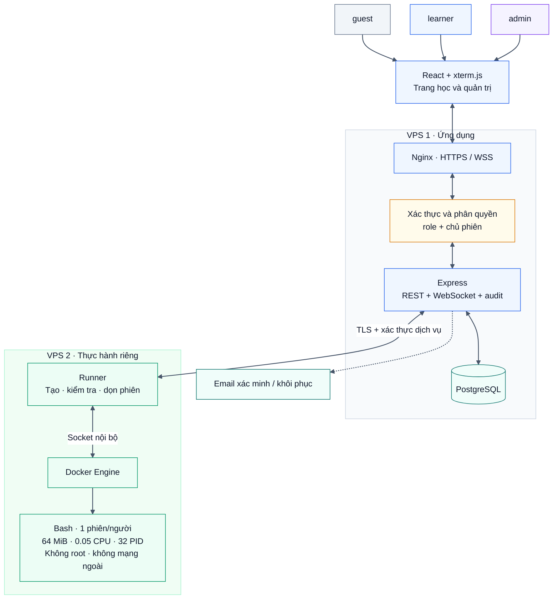
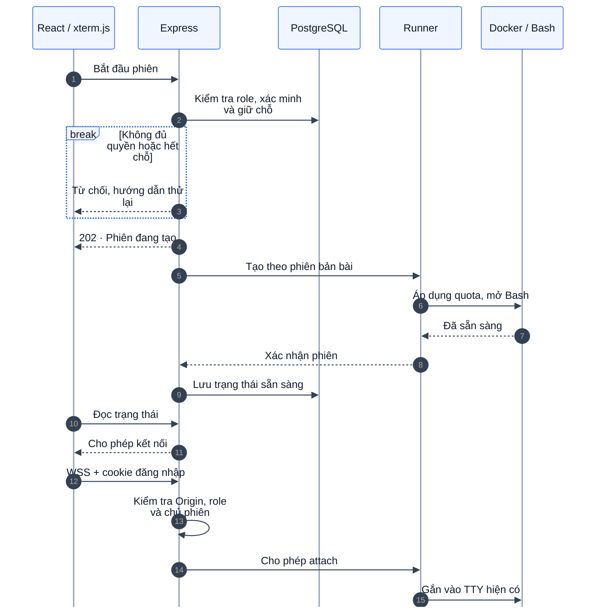
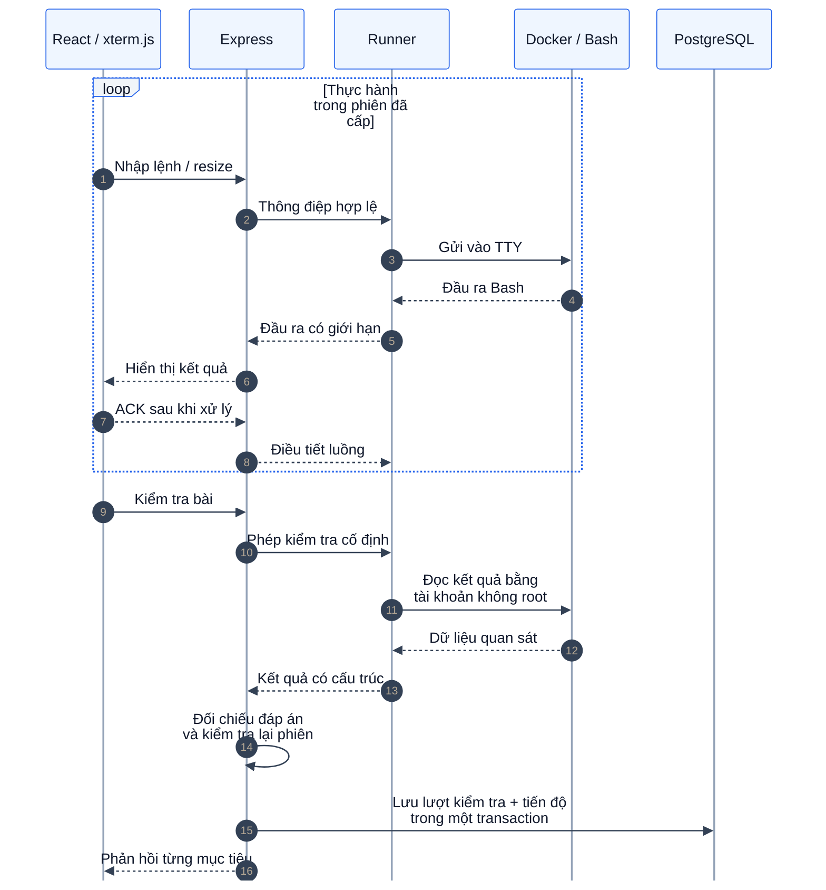
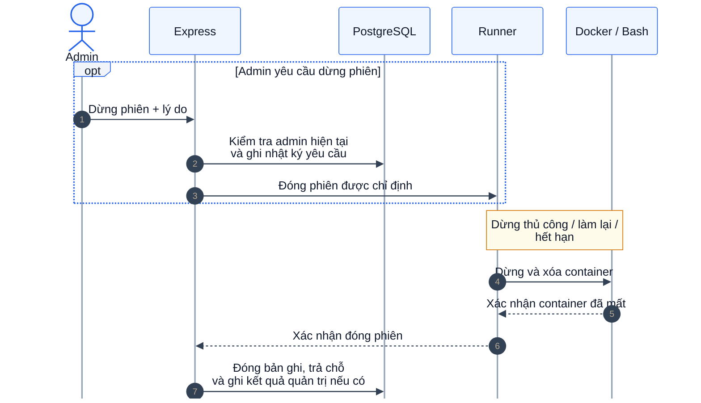
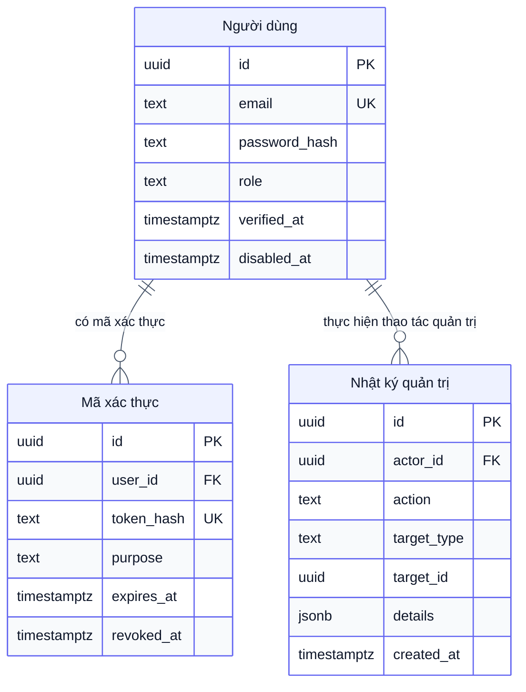
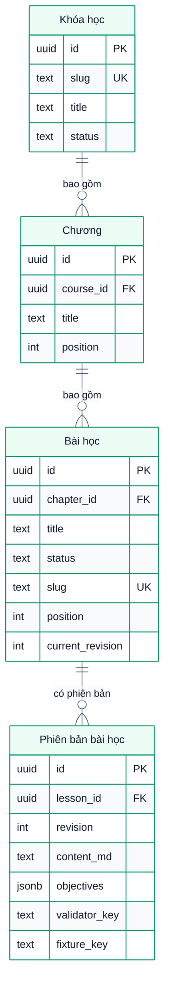
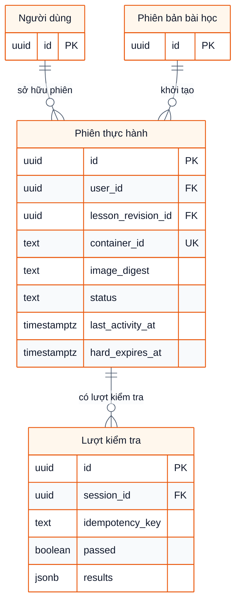
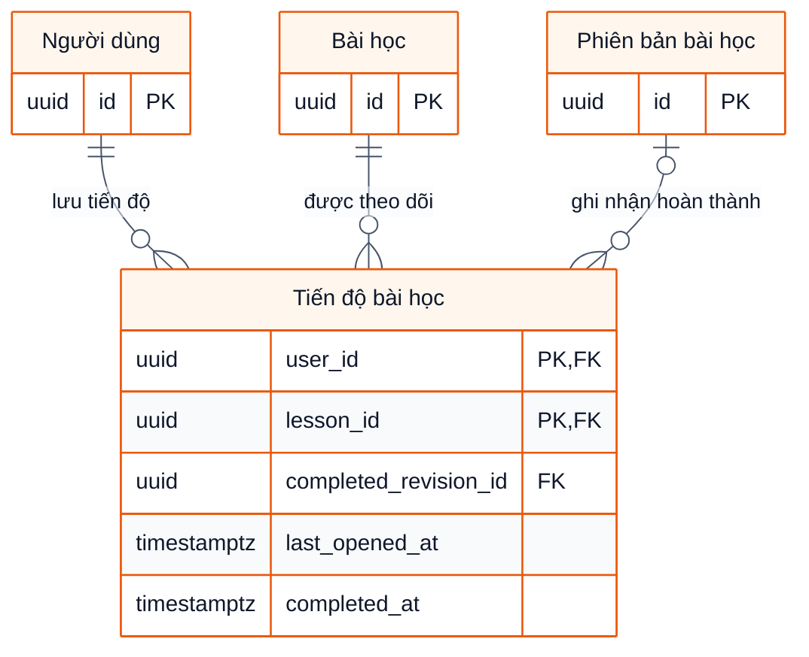

# BashLab — Kế hoạch triển khai MVP

Trạng thái: chờ duyệt, chưa viết mã ứng dụng.
Cập nhật: 11/09/2026. Tham chiếu giao diện: [image.png](image.png).
Bản tiếng Việt; nội dung tương ứng với [bản tiếng Anh](plan.md).

## 1. Mục tiêu và phạm vi

BashLab giúp người mới học lệnh Linux bằng cách đọc hướng dẫn, thực hành trong Bash thật và kiểm tra kết quả ngay trên website.
MVP tập trung vào một vòng học hoàn chỉnh: chọn bài → thực hành → kiểm tra → lưu tiến độ → học tiếp.
Tất cả bài học đều miễn phí. Bỏ toàn bộ VIP, nạp tiền, thanh toán và lịch sử giao dịch.

| Chức năng | Phạm vi thực hiện |
|---|---|
| Trang chủ | Giới thiệu cách học, khóa học mẫu, nút bắt đầu |
| Tài khoản | Đăng ký, đăng nhập/xuất, xác minh/khôi phục, phân quyền guest/learner/admin |
| Nội dung | Khóa học → chương → bài học, có thứ tự rõ ràng |
| Trang học | Hướng dẫn, ví dụ, mục tiêu, gợi ý và terminal |
| Thực hành | Bash thật trong Docker, một phiên hoạt động/người dùng |
| Kiểm tra | Máy chủ kiểm tra kết quả khi bấm “Kiểm tra bài” |
| Tiến độ | Bài đã hoàn thành, phần trăm khóa học, tiếp tục bài gần nhất |
| Vận hành | Dọn phiên hết hạn, theo dõi tài nguyên, sao lưu dữ liệu |
| Quản trị | Người dùng/role, phát hành nội dung, theo dõi phiên, nhật ký thao tác |

Nội dung ban đầu: 12–16 bài, chia thành hai khóa nhỏ.

- Linux cơ bản: thư mục, tệp, đọc nội dung và quyền của tệp do người học sở hữu.
- Bash xử lý văn bản: chuyển hướng, pipe, `grep`, `sort`, `uniq`, `cut`, `awk` cơ bản.

Mỗi bài có 1–3 mục tiêu, dùng dữ liệu mẫu nhỏ và hoàn thành được trong giới hạn container.
Chưa làm trình biên tập khóa học, bảng xếp hạng, chứng chỉ, AI, nhiều terminal hay lưu thư mục cá nhân lâu dài.
Không đưa cài phần mềm, quản trị root, truy cập mạng hoặc xử lý dữ liệu lớn vào chương trình ban đầu.
Soạn nội dung/bộ kiểm tra trong Git rồi nhập phiên bản; admin quản lý thông tin, thứ tự và phát hành ngay trên website.

### Vai trò và quyền truy cập

| Thao tác | guest | learner | admin |
|---|---|---|---|
| Đọc danh mục/bài đã phát hành | Có | Có | Có |
| Dùng terminal và lưu tiến độ của mình | Không | Tài khoản đã xác minh | Cùng giới hạn với learner |
| Vào shell hoặc sửa kết quả của người khác | Không | Không | Không |
| Quản lý tài khoản/role, xem tiến độ tổng hợp | Không | Không | Có, ghi nhật ký |
| Quản lý thông tin/trạng thái phát hành nội dung | Không | Không | Có, dùng phiên bản đã nhập |
| Xem thông tin phiên, dừng phiên lỗi, đọc nhật ký | Không | Không | Có, dừng phải ghi lý do |

`guest` là khách chưa đăng nhập, không phải tài khoản trong DB. `users.role` chỉ lưu `learner` hoặc `admin`; đăng ký mới luôn là learner.
API kiểm tra role, trạng thái tài khoản và chủ sở hữu trên từng yêu cầu; ẩn nút admin chỉ phục vụ giao diện. [Hướng dẫn phân quyền](https://cheatsheetseries.owasp.org/cheatsheets/Authorization_Cheat_Sheet.html)

## 2. Công nghệ chốt

| Thành phần | Lựa chọn |
|---|---|
| Giao diện | HTML5, React 19, JavaScript/JSX |
| CSS | CSS thuần, biến CSS, Flexbox và Grid |
| Công cụ build | Vite, npm và lockfile |
| Điều hướng | React Router |
| Máy chủ | Node.js 24 LTS, Express.js 5 |
| Giao tiếp | REST API và WebSocket qua thư viện `ws` |
| Terminal | `@xterm/xterm`, addon fit |
| Cơ sở dữ liệu | PostgreSQL 18, thư viện `pg`, migration SQL |
| Sandbox | Docker Engine trên Linux, GNU Bash và công cụ GNU cần thiết |
| Reverse proxy | Nginx, HTTPS/WSS |
| Kiểm thử | Node test runner và Playwright, đều viết JavaScript |

Không dùng TypeScript hoặc Tailwind CSS trong mã nguồn, cấu hình hay kiểm thử.
Chọn PostgreSQL; chưa có lý do kỹ thuật để đổi sang MySQL hoặc hỗ trợ cả hai.
Khóa phiên bản thư viện và image khi bắt đầu triển khai; ưu tiên bản vá còn được hỗ trợ.
Không thêm ORM, Redis, hàng đợi riêng hoặc Kubernetes cho quy mô này.

## 3. Giao diện và sitemap

Theo `image.png`: nền tối, điểm nhấn xanh, hướng dẫn bên trái, terminal bên phải.
Giữ một danh sách mục tiêu; dùng trạng thái và phản hồi rõ ràng thay cho nhiều chi tiết trang trí.
Trên desktop có thanh chia kéo được; trên màn hình nhỏ chuyển giữa tab “Bài học” và “Terminal”.
Các nút chính: Bắt đầu terminal, Kiểm tra bài, Làm lại, Dừng, Bài tiếp theo.

```text
/
├── /courses
│   └── /courses/:courseSlug
├── /register
├── /login
├── /verify-email
├── /forgot-password
├── /reset-password
├── /dashboard
├── /learn/:courseSlug/:lessonSlug
├── /account
├── /admin
│   ├── /admin/users
│   ├── /admin/content
│   ├── /admin/sessions
│   └── /admin/audit-logs
└── /help
```

Trang khóa học hiển thị chương, bài, thời lượng dự kiến và tiến độ.
Guest đọc được bài đã phát hành; learner/admin đang hoạt động và đã xác minh mới được mở sandbox của mình.
Chỉ tạo container khi bấm bắt đầu, không tạo ngay khi mở trang.
Hiển thị đầy đủ trạng thái: đang tạo, sẵn sàng, đang kiểm tra, mất kết nối, hết hạn và hết chỗ.
Làm lại hoặc chuyển bài phải báo rõ việc mất tệp tạm; tiến độ đã hoàn thành vẫn được giữ.
Hỗ trợ bàn phím, focus dễ thấy, chữ dễ đọc và cách chuyển focus ra khỏi terminal.
Admin dùng bảng/form đơn giản: lọc người dùng, khóa/mở tài khoản, đổi role, xem tiến độ tổng hợp.
Quản lý nội dung gồm tạo/sửa thông tin khóa/chương, sắp xếp bài, chọn phiên bản đã nhập, phát hành/ẩn; không có editor nâng cao hoặc tải bộ kiểm tra lên.
Import thêm phiên bản, không ghi đè thông tin/trạng thái admin đã sửa; đổi phiên bản đang phát hành phải kiểm tra đủ tài nguyên và cập nhật con trỏ nguyên tử.
Khi phát hành phải có đủ dữ liệu mẫu/bộ kiểm tra; khi ẩn sẽ chặn truy cập/phiên mới, phiên cũ đang dùng phiên bản cố định được học đến hết hạn.
Màn hình phiên chỉ hiện chủ phiên/bài/tuổi/trạng thái và nút Dừng có lý do; nhật ký chỉ đọc. Không chiếm shell, sửa tiến độ, xóa hàng loạt hoặc đổi quota.

## 4. Kiến trúc đề xuất

Chọn Nginx phục vụ React và API trên cùng tên miền; Docker chạy ở một VPS riêng.
Sơ đồ dùng nền sáng riêng: xanh dương cho web, vàng cho kiểm tra quyền, xanh lá cho sandbox, tím cho admin.
Cách này giữ đăng nhập/WebSocket đơn giản và tách nơi chạy lệnh của người học khỏi dữ liệu tài khoản.



Chỉ cần hai tiến trình nghiệp vụ: API và runner; không cần worker độc lập trong MVP.
API quản lý tài khoản, bài học, tiến độ và quyền mở phiên.
Runner tạo/xóa container, truyền dữ liệu terminal, chạy kiểm tra và dọn phiên.
Chỉ runner được dùng Docker socket; API và container người học không được truy cập socket này.
Runner không giữ mật khẩu cơ sở dữ liệu hoặc thông tin tài khoản người học.

Vercel vẫn dùng được cho React nếu muốn, nhưng không chạy backend dài hạn hoặc Docker ở đó.
Với Vercel, dùng `app.example.com` cho frontend và `api.example.com` cho API/WSS; cấu hình origin và cookie rõ ràng.
Một VPS gộp mọi thứ phù hợp bản thử nghiệm nội bộ, nhưng rủi ro hơn khi mở shell cho người lạ.
Lựa chọn mặc định cho bản công khai vẫn là hai VPS; không cần managed database ngay từ đầu.

## 5. Vòng đời terminal

Mỗi người có tối đa một phiên còn sống và một kết nối được quyền nhập lệnh.
Tab thứ hai dùng lại phiên hiện có; muốn điều khiển phải xác nhận chuyển quyền từ tab trước.
Tải lại trang sẽ nối vào Bash đang chạy, không tự tạo container mới.

| Sự kiện | Cách xử lý |
|---|---|
| Bắt đầu bài | Kiểm tra quyền, giữ chỗ, tạo container từ image đã duyệt |
| Mất kết nối | Giữ phiên đến khi hết thời gian không hoạt động |
| Không hoạt động 10 phút | Hiện cảnh báo |
| Không hoạt động 12 phút | Dừng và xóa container; bộ dọn chạy mỗi 30 giây |
| Phiên đạt 60 phút | Cảnh báo trước 5 phút, sau đó yêu cầu phiên mới |
| Làm lại/chuyển bài | Xóa phiên cũ trước khi tạo phiên mới |
| Lệnh vượt tài nguyên | Báo nguyên nhân và cho tạo lại; không mất tiến độ |
| Hoàn thành bài | Giữ terminal để xem kết quả đến khi dừng hoặc hết hạn |

Chỉ dữ liệu nhập và yêu cầu kiểm tra được chấp nhận mới tính là hoạt động.
Heartbeat, resize, đầu ra liên tục hoặc tab đang mở không kéo dài thời gian sống.
API kiểm tra lại đăng nhập/role mỗi phút và gia hạn quyền điều khiển runner tối đa hai phút.
Đăng xuất, khóa tài khoản hoặc đổi role sẽ thu hồi phiên đăng nhập/socket; hạn cấp quyền buộc runner dọn phiên nếu lệnh dừng trực tiếp thất bại.
Tệp trong sandbox là tạm thời; không cam kết khôi phục sau khi container bị xóa hoặc VPS hỏng.

## 6. Luồng Docker và WebSocket

Tách thành ba bước để dễ đọc; nét liền là yêu cầu, nét đứt là phản hồi hoặc ACK.

**6.1 · Mở phiên và kết nối**



**6.2 · Thực hành và kiểm tra bài**



**6.3 · Dừng phiên và trả tài nguyên**



Docker cung cấp TTY; runner dùng API attach/resize qua thư viện JavaScript như `dockerode`.
Không cần SSH, `node-pty`, WebSocket server hoặc cổng mạng trong từng container.
Không ghép lệnh Docker từ chuỗi do người dùng gửi; mọi cấu hình do máy chủ quyết định.

## 7. Giới hạn và bảo vệ sandbox

| Tài nguyên/quyền | Thiết lập |
|---|---|
| RAM | 64 MiB theo đơn vị Docker, tương ứng mục tiêu 64 MB |
| Swap bổ sung | Không cho phép |
| CPU | Giới hạn 0.05 CPU, không dùng CPU shares thay thế |
| Số tiến trình | Tối đa 32, gồm init, Bash và tiến trình kiểm tra |
| Người chạy | UID/GID không phải root |
| Mạng | `none`, không mở port; chỉ còn loopback |
| Hệ thống tệp gốc | Chỉ đọc |
| Thư mục làm việc | tmpfs 16 MiB; cho phép chạy script của bài học |
| `/tmp` và shared memory | Tối đa 8 MiB và 1 MiB |
| Quyền Linux | Bỏ toàn bộ capabilities, bật `no-new-privileges` |
| Chính sách hệ thống | Giữ seccomp mặc định và lớp bảo vệ của Linux host |
| Tệp mở | Khởi điểm 256 descriptor/tiến trình |

Dung lượng tmpfs nằm trong 64 MiB RAM, không phải bộ nhớ cộng thêm.
Dùng image Debian slim với Bash và bộ lệnh GNU cần thiết; cài công cụ khi build image.
Image chỉ đọc, có init nhỏ để thu gom tiến trình con và không tự restart phiên người học.
Không mount thư mục host, socket Docker, thiết bị hoặc secret vào sandbox.
Ưu tiên rootless Docker trên Linux có cgroup v2 và systemd được cấu hình đúng.
Kiểm tra giới hạn thực tế; chỉ nhìn cấu hình Docker chưa đủ để khẳng định đã được áp dụng.
Nếu host không áp dụng được giới hạn thì chưa mở terminal công khai, không âm thầm bỏ giới hạn.
Container dùng chung kernel: tách VPS giảm phạm vi ảnh hưởng nhưng không thay thế hoàn toàn máy ảo.

## 8. Kiểm tra bài và lưu tiến độ

Chỉ kiểm tra những kết quả quan sát được: tệp/thư mục, nội dung và quyền truy cập.
Ví dụ: người học lọc log rồi lưu vào tệp kết quả; hệ thống so sánh tệp đó với yêu cầu.
Chấp nhận nhiều cách giải đúng, không bắt buộc khớp nguyên văn một câu lệnh.

- Bộ kiểm tra do máy chủ chọn theo phiên bản bài học; trình duyệt không gửi lệnh kiểm tra.
- Dùng công cụ cố định, môi trường sạch và tài khoản kiểm tra riêng không phải root.
- Không chạy script do người học viết để quyết định đạt/trượt; không đọc kết quả từ terminal làm bằng chứng.
- Chỉ đọc tệp hợp lệ trong vùng cho phép; từ chối symlink, FIFO, tệp quá lớn và đường dẫn bất thường.
- Mỗi phiên chỉ kiểm tra một lần tại một thời điểm; tối đa bốn lượt đồng thời trên runner.
- Giới hạn ban đầu: 5 giây/lượt và 32 KiB kết quả, sau đó đo lại bằng bài thật.
- Nếu quá hạn mà không chắc đã dừng được tiến trình kiểm tra, xóa sandbox đó.
- Kiểm tra lại chủ phiên/trạng thái trước khi ghi tiến độ để tránh kết quả cũ sau reset.

Một lượt phải đạt đủ các mục tiêu mới hoàn thành bài; không ghép các kết quả đã lỗi thời.
Lưu phản hồi từng mục tiêu, thời điểm và phiên bản bài học; không lưu toàn bộ lịch sử terminal.
Bài đã hoàn thành vẫn được giữ sau khi làm lại hoặc sửa nội dung; phần trăm khóa học được tính từ số bài đã học.
Một lệnh Docker exec riêng không biết thư mục hiện tại hoặc biến của Bash tương tác; không dùng nó để suy đoán lịch sử thao tác.
Đây là kiểm tra phục vụ học tập, không phải hệ thống chống gian lận cho kỳ thi.

## 9. Thiết kế PostgreSQL

Giữ nội dung theo phiên bản để một bài đang học không đổi yêu cầu giữa chừng.
Không cần bảng riêng cho từng mục tiêu: lưu danh sách mục tiêu bằng JSONB trong phiên bản bài.
ERD dưới đây thể hiện các trường chính; timestamp và một số ràng buộc phụ sẽ được bổ sung khi triển khai.
Nhãn sơ đồ được Việt hóa; tên cột, kiểu dữ liệu, API và biến cấu hình giữ nguyên để hai bản dùng cùng thiết kế.
ERD chia thành ba nhóm; bảng chỉ có `id` ở nhóm sau là tham chiếu đến định nghĩa đầy đủ ở nhóm trước.

**9.1 · Tài khoản và quản trị**



**9.2 · Khóa học và phiên bản bài**



**9.3 · Phiên thực hành và kiểm tra**



**9.4 · Tiến độ bài học**



Email không trùng khi khác chữ hoa/thường; mật khẩu dùng hàm băm chuyên dụng như `scrypt` với salt riêng.
Token đăng nhập/reset/xác minh chỉ lưu bản băm; token một lần phải được đánh dấu đã dùng.
Dùng khóa ngoại, truy vấn có tham số và thời gian UTC; giới hạn `users.role` ở `learner/admin`, mặc định `learner`.
Tạo admin đầu tiên bằng CLI trên máy chủ để nâng quyền một tài khoản đã xác minh; ghi nhật ký và không có mật khẩu admin mặc định.
Đổi role/trạng thái cần xác nhận mật khẩu gần đây (5 phút), transaction bảo vệ admin hoạt động đã xác minh cuối cùng và nhật ký; chặn tự khóa/hạ quyền.
Nhật ký lưu người thực hiện, hành động, đối tượng, thay đổi/lý do đã lọc và thời gian; thêm bản ghi yêu cầu/kết quả dừng phiên, không lưu mật khẩu hay nội dung terminal. Ứng dụng chỉ thêm/đọc, không có route sửa/xóa nhật ký.
Ràng buộc thứ tự trong mỗi chương và số phiên bản trong mỗi bài là duy nhất.
Dùng partial unique index để mỗi người chỉ có một phiên `starting/ready/detached/closing`.
Giữ chỗ tổng trong transaction có khóa; chỉ trả chỗ sau khi xác nhận container đã bị xóa.
Lưu lượt kiểm tra và hoàn thành bài trong một transaction; khóa chống lặp được ràng buộc theo phiên.
Không sửa phiên bản đã phát hành; giữ bộ kiểm tra/image tương ứng đến khi phiên đang dùng kết thúc.

## 10. API và bảo mật web

REST dùng tiền tố `/api/v1`; tài nguyên luôn được kiểm tra theo người đang đăng nhập.

| Phương thức | Đường dẫn | Mục đích |
|---|---|---|
| POST | `/auth/register`, `/auth/login`, `/auth/logout`, `/auth/reauth` | Tài khoản, phiên đăng nhập, xác nhận lại mật khẩu |
| POST | `/auth/verify-email`, `/auth/resend-verification` | Xác minh email |
| POST | `/auth/forgot-password`, `/auth/reset-password` | Khôi phục tài khoản |
| GET | `/auth/csrf`, `/me` | CSRF token và thông tin người dùng |
| GET | `/courses`, `/courses/:slug` | Danh mục và cấu trúc khóa học |
| GET | `/lessons/:id` | Nội dung được phép xem, không lộ bộ kiểm tra |
| POST | `/lessons/:id/open` | Ghi bài vừa mở |
| GET | `/me/progress` | Tiến độ và bài học gần nhất |
| POST | `/terminal-sessions` | Giữ chỗ, tạo hoặc trả phiên tương thích |
| GET | `/terminal-sessions/current` | Trạng thái phiên hiện tại |
| DELETE | `/terminal-sessions/:id` | Dừng/xóa phiên, gọi lại không gây lỗi |
| POST | `/terminal-sessions/:id/reset` | Thay phiên bằng sandbox sạch |
| POST | `/lessons/:id/check` | Kiểm tra phiên và trả phản hồi |
| GET | `/health/live`, `/health/ready` | Sức khỏe ứng dụng; báo tình trạng runner riêng |
| GET | `/admin/overview`, `/admin/users`, `/admin/sessions`, `/admin/audit-logs` | Chỉ admin; dữ liệu vận hành có lọc/phân trang |
| PATCH | `/admin/users/:id/role`, `/admin/users/:id/status` | Đổi role/trạng thái; xác nhận mật khẩu gần đây và ghi nhật ký |
| GET, POST, PATCH | `/admin/courses`, `/admin/courses/:id`, `/admin/chapters`, `/admin/chapters/:id` | Đọc/tạo ở danh sách; sửa thông tin/thứ tự theo ID |
| GET, PATCH | `/admin/lessons`, `/admin/lessons/:id` | Đọc bài đã nhập; sửa thông tin/thứ tự/phiên bản được chọn |
| POST | `/admin/lessons/:id/publish`, `/admin/lessons/:id/unpublish` | Chuyển trạng thái phát hành; kiểm tra đủ tài nguyên phiên bản |
| POST | `/admin/terminal-sessions/:id/stop` | Lý do và khóa chống lặp; ghi nhật ký, chờ xác nhận dừng |

Tạo terminal có thể trả `202` rồi giao diện đọc trạng thái; bài làm sai trả kết quả bình thường với `passed=false`.
Phân biệt chưa đăng nhập `401`, không có quyền `403/404`, xung đột `409`, dữ liệu sai `422`, quá nhanh `429`, hết chỗ `503`.
WebSocket tại `/ws/terminal-sessions/:id`, dùng cookie đăng nhập và kiểm tra chính xác `Origin` trước khi attach.
Cookie production là Secure, HttpOnly, host-only; REST thay đổi dữ liệu phải có bảo vệ CSRF.
Không đặt token đăng nhập hay Docker ID vào URL; không coi UUID là quyền truy cập.
Giới hạn đăng ký, đăng nhập, tạo/reset phiên, kiểm tra và kích thước thông điệp.
Markdown được làm sạch; dữ liệu terminal chỉ render bằng xterm, không chèn thành HTML.
Mọi `/admin/*` cần admin đang hoạt động và đã xác minh theo DB; từ chối guest/learner kể cả khi giả trường role.
Đăng ký/sửa hồ sơ chỉ nhận trường cho phép, không nhận `role`; `/me` trả role để hiện menu, không để trình duyệt tự cấp quyền.

## 11. Chống quá tải và phục hồi

| Mức tải | RAM container tối đa | Tổng CPU quota | Số tiến trình tối đa |
|---|---:|---:|---:|
| 20 phiên | 1.25 GiB | 1 CPU | 640 |
| 50 phiên | 3.125 GiB | 2.5 CPU | 1.600 |

Đây là phép tính giới hạn, chưa gồm Linux, Docker và Node; không phải kết quả đo hiệu năng.
Khởi điểm đề xuất: VPS ứng dụng 2 vCPU/4 GiB, VPS runner 4 vCPU/8 GiB.
Mở 20 phiên trước, chỉ nâng lên 50 sau kiểm thử; giới hạn thêm theo sức khỏe host.

- Giữ chỗ cả phiên đang tạo/đang xóa; runner cũng có giới hạn độc lập để chặn vượt tải.
- Giới hạn bốn container khởi tạo đồng thời; tải sẵn image, không build/pull khi người học bắt đầu.
- Tải xterm khi vào trang học; giữ scrollback khoảng 2.000 dòng.
- Khởi điểm: input tối đa 16 KiB/thông điệp, bộ đệm đầu ra khoảng 256 KiB/phiên.
- Dùng ACK sau khi xterm xử lý dữ liệu và backpressure xuyên các chặng; dừng phiên nếu vẫn gây tràn.
- Không lưu từng phím vào DB; gộp cập nhật hoạt động khoảng 30 giây/lần.
- Gắn nhãn container theo ứng dụng, ID phiên, phiên bản bài và hạn sống.
- Khi API/runner khởi động lại, đối chiếu DB với container có nhãn; xử lý phiên mồ côi trước khi nhận thêm.
- Timeout tạo/xóa chưa chứng minh thao tác thất bại; kiểm tra lại theo ID để tránh tạo trùng/trả chỗ sớm.
- Chỉ xóa container của BashLab; runner lỗi thì vẫn cho đọc bài và xem tiến độ.

## 12. Thư mục dự kiến

```text
bashlab/
├── plan.md                  # Bản tiếng Anh
├── plan.vi.md               # Bản tiếng Việt
├── image.png
├── frontend/
│   ├── index.html
│   ├── vite.config.js
│   └── src/
│       ├── app/              # App.jsx, router.jsx
│       ├── pages/            # Trang chủ, tài khoản, khóa học, bài học, admin
│       ├── components/       # Layout, mục tiêu, terminal
│       ├── hooks/
│       ├── lib/              # REST client, kết nối terminal
│       └── styles/           # CSS thuần
├── backend/
│   ├── src/
│   │   ├── server.js
│   │   ├── modules/          # auth, courses, progress, terminals, admin, audit
│   │   └── middleware/
│   ├── migrations/           # SQL có phiên bản
│   └── tests/                # JavaScript
├── runner/
│   ├── src/                  # Docker, phiên, kiểm tra, cleanup
│   └── tests/
├── content/                  # Markdown, JSON, fixtures, validators
├── docker/                   # Image web, backend, sandbox
├── deploy/                   # Compose, Nginx, runner systemd
└── tests/                    # E2E và tải HTTP/WebSocket
```

Chỉ tách file theo chức năng thật; không tạo nhiều lớp controller/service/repository khi chưa cần.
Runner là tiến trình Node riêng dùng Docker socket cục bộ, không cần Docker-in-Docker.
Hiện tại chỉ cập nhật `plan.md` và `plan.vi.md`, chưa tạo các thư mục ứng dụng.

## 13. Môi trường và biến cấu hình

Dev: Windows + WSL2/Linux containers, Vite proxy API/WS, PostgreSQL và runner cục bộ.
Staging: Linux có cấu hình Docker/cgroup như production, dữ liệu và email thử nghiệm riêng.
Production: React đã build qua Nginx; API chạy dài hạn, runner do systemd quản lý, DB có volume bền vững.
Không dùng Vite dev server ở production; Docker Desktop không thay thế kiểm thử giới hạn trên Linux thật.

| Biến | Nơi dùng / ý nghĩa |
|---|---|
| `VITE_API_BASE_URL`, `VITE_WS_BASE_URL` | Public; mặc định `/api/v1` và `/ws` |
| `NODE_ENV`, `PORT` | API; chế độ và cổng nội bộ |
| `APP_ORIGIN`, `ALLOWED_ORIGINS` | API; tên miền và origin được phép |
| `DATABASE_URL` | API; secret kết nối PostgreSQL |
| `MIGRATION_DATABASE_URL` | Chỉ tiến trình migration; quyền đổi schema |
| `DB_POOL_MAX` | API; khởi điểm 10 kết nối |
| `SESSION_TTL_SECONDS`, `CSRF_SIGNING_SECRET` | Hạn đăng nhập và secret bảo vệ CSRF |
| `SMTP_HOST`, `SMTP_PORT`, `SMTP_USER`, `SMTP_PASSWORD`, `EMAIL_FROM` | API; gửi thư xác minh/reset |
| `RUNNER_URL`, `RUNNER_SHARED_SECRET`, `RUNNER_CA_FILE` | API; kết nối runner riêng có xác thực |
| `RUNNER_ID`, `RUNNER_BIND_HOST`, `RUNNER_PORT` | Runner; định danh và địa chỉ riêng |
| `RUNNER_TLS_CERT_FILE`, `RUNNER_TLS_KEY_FILE` | Runner; chứng chỉ và khóa TLS |
| `DOCKER_HOST`, `SANDBOX_IMAGE` | Runner; socket rootless và image cố định bằng digest |
| `MAX_ACTIVE_SESSIONS` | API và runner; khởi điểm 20 |
| `SESSION_IDLE_WARN_SECONDS`, `SESSION_IDLE_TIMEOUT_SECONDS` | Runner; 600 và 720 |
| `SESSION_MAX_LIFETIME_SECONDS`, `SESSION_SWEEP_INTERVAL_SECONDS` | Runner; 3600 và 30 |
| `CONTROL_LEASE_SECONDS`, `VALIDATION_TIMEOUT_MS`, `LOG_LEVEL` | Runner; 120, 5000 và mức log |

Runner cũng giữ bản riêng của secret kết nối; không nhận secret DB/email.
Các giới hạn 64 MiB/0.05 CPU/32 PID nằm trong chính sách máy chủ, không cho trình duyệt sửa.
Mọi biến `VITE_*` đều công khai; không đưa secret vào frontend hoặc Git.
Xoay secret runner bằng cách ngừng nhận phiên mới, đổi hai đầu rồi kiểm tra kết nối trước khi mở lại.
Nếu nghi lộ secret: thu hồi ngay kết nối/quyền điều khiển, không chờ lịch bảo trì.

## 14. Triển khai thực tế

1. Chốt domain, VPS Linux, vùng máy chủ và dịch vụ email; chưa mua/provision trong bước lập kế hoạch.
2. Tạo VPS ứng dụng và VPS runner; cấu hình SSH key, firewall, cập nhật bảo mật và đồng bộ giờ.
3. Chỉ mở HTTPS công khai; DB không mở port ra Internet, runner chỉ nhận từ VPS ứng dụng.
4. Cài Node LTS, Docker/Compose và rootless Docker; cấu hình systemd/cgroup trên runner.
5. Build React, API và image Bash; khóa digest, tải sẵn image và cấu hình TLS/secret riêng.
6. Khởi tạo PostgreSQL, migration role/nhật ký, nhập bài/kiểm tra phiên bản và tạo admin đầu tiên đã xác minh.
7. Chạy API/runner, kiểm tra kết nối riêng và cơ chế đối chiếu phiên sau restart.
8. Nginx phục vụ React, proxy REST/WS đúng header/timeout; API không được trả nhầm HTML của SPA.
9. Cấu hình email, thử luồng học và quyền guest/learner/admin, khóa tài khoản, phát hành và dừng phiên có nhật ký.
10. Kiểm tra tải 20 rồi 50 phiên, thử vượt tài nguyên, mất kết nối và dọn phiên.
11. Bật backup DB mã hóa hằng ngày ra ngoài VPS; thử khôi phục trước khi mở bản beta.
12. Theo dõi lỗi/tài nguyên và tăng giới hạn từ từ; lưu hướng dẫn cập nhật, drain phiên và rollback.

Nếu chọn Vercel, chỉ deploy `frontend/` với output `dist`; REST và WSS kết nối thẳng VPS.
Dùng domain cùng site, cookie host-only của API, request có credentials và CORS chính xác; không dùng wildcard.
Preview dùng backend staging riêng; không nối tùy tiện vào tài khoản/dữ liệu production.
Backup ban đầu có thể mất tối đa 24 giờ cập nhật; cần ít hơn thì chọn PostgreSQL managed có phục hồi theo thời điểm.
Khi bảo trì runner, ngừng cấp phiên mới và báo trước; không hứa giữ tệp tạm qua lỗi host.

## 15. Lộ trình bốn tuần

Giả định một lập trình viên có kinh nghiệm làm toàn thời gian, có hỗ trợ nội dung/QA bán thời gian.
Dành khoảng 3–4 ngày công cho admin tối thiểu và kiểm thử quyền; ưu tiên 12 bài lúc ra mắt, chỉ tăng lên 16 nếu còn thời gian.

| Tuần | Công việc chính | Điều kiện hoàn thành |
|---|---|---|
| 1 | Stack JavaScript, DB, role/kiểm tra quyền, admin đầu tiên, khóa học, Bash/WS có giới hạn thật | Bài đầu tiên chạy được; ranh giới guest/learner/admin được kiểm tra |
| 2 | Vòng đời phiên, reset/reconnect, cleanup, kiểm tra bài, tiến độ, layout theo ảnh | Ít nhất bốn bài hoàn chỉnh; 20 phiên chạy ổn định |
| 3 | Bảng admin tối thiểu, phát hành, nhật ký, 12 bài cốt lõi, giao diện nhỏ/lỗi/restart | Quản trị dùng được; bài đúng giới hạn và không truy cập chéo phiên |
| 4 | Deploy, kiểm tra leo thang/thu hồi quyền, tải 50 phiên, phá giới hạn, backup/restore và sửa lỗi | Chỉ mở beta khi đạt kiểm thử quyền và mức tải đã đo |

Ưu tiên phần rủi ro nhất từ tuần đầu: Docker thực, TTY, giới hạn tài nguyên; không để đến cuối mới tích hợp terminal.
Nếu thiếu thời gian, giảm số bài hoặc độ bóng bẩy giao diện; giữ nguyên kiểm soát truy cập, cleanup và backup.
Nếu một người tự làm cả nội dung, thiết kế và vận hành từ đầu, nên dự phòng tổng cộng 6–8 tuần.

## 16. Tiêu chí nghiệm thu và phương án dự phòng

- Đăng nhập/reset/logout đúng; learner không đọc tiến độ người khác, admin chỉ xem tổng hợp được phép và không điều khiển shell của họ.
- Từ chối guest/learner gọi API admin, giả role, dùng quyền cũ hoặc thao tác đồng thời làm mất admin cuối cùng.
- Đổi tài khoản/role thu hồi phiên; phát hành kiểm tra đủ tài nguyên; dừng phiên ghi yêu cầu/kết quả và không cấp quyền host.
- Không tạo trùng phiên khi gửi đồng thời; kết quả kiểm tra cũ không được ghi sau reset.
- Giới hạn RAM, swap, CPU, PID và non-root/no-network được chứng minh bằng hành vi thực tế.
- Phiên bỏ quên được dọn đúng hạn; reset/restart không để sót container hoặc giữ chỗ vô thời hạn.
- Chạy tải hỗn hợp 20 rồi 50 phiên ít nhất 30 phút/mức, gồm thao tác, kiểm tra, tạo/xóa và mất kết nối.
- Mục tiêu ban đầu: p95 phản hồi gõ ≤300 ms, mở phiên ≤5 giây khi image đã có, kiểm tra thường ≤2 giây.
- Đo burst riêng; giữ Ctrl-C dùng được khi đầu ra liên tục, bộ đệm và bộ nhớ không tăng vô hạn.
- Backup khôi phục được; log không chứa mật khẩu, cookie, token hoặc toàn bộ nội dung terminal.

Nếu 50 phiên chưa đạt, giữ giới hạn đã kiểm chứng hoặc tăng cấu hình host, không tự tăng quota mỗi container.
Nếu một bài quá nặng, giảm dữ liệu/tiến trình hoặc bỏ bài đó khỏi đợt đầu.
Nếu thiếu ngân sách hai VPS, dùng một VPS cho thử nghiệm nội bộ và ghi rõ rủi ro trước khi mở công khai.
Đây là tiêu chí phải kiểm tra khi triển khai, chưa phải kết quả đã được xác nhận.

## 17. Tài liệu tham chiếu

Các lựa chọn đã đối chiếu với tài liệu chính thức; thông số hiệu năng trong kế hoạch là mục tiêu cần đo.

- [Docker: giới hạn tài nguyên](https://docs.docker.com/engine/containers/resource_constraints/) và [tmpfs](https://docs.docker.com/engine/storage/tmpfs/).
- [Docker: điều kiện rootless/cgroup](https://docs.docker.com/engine/security/rootless/tips/) và [bảo mật](https://docs.docker.com/engine/security/).
- [xterm.js: flow control](https://xtermjs.org/docs/guides/flowcontrol/) và [bảo mật terminal](https://xtermjs.org/docs/guides/security/).
- [Nginx: WebSocket](https://nginx.org/en/docs/http/websocket.html), [Vercel: Vite](https://vercel.com/docs/frameworks/frontend/vite), [Vite: biến môi trường](https://vite.dev/guide/env-and-mode).

Hai bản kế hoạch có cùng phạm vi; chờ duyệt trước khi viết mã ứng dụng hoặc triển khai hạ tầng.
